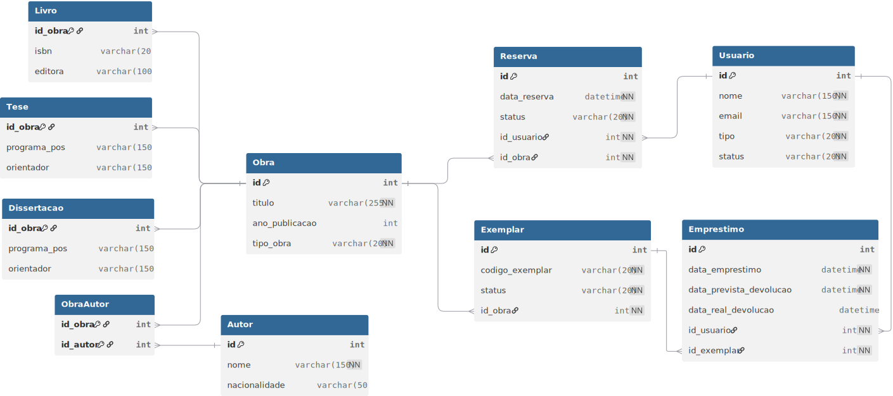

# Desenvolvimento de uma Plataforma de Gestão de Biblioteca Acadêmica com ORM
O sistema deve permitir o cadastro de livros, dissertações, teses, autores, exemplares físicos, empréstimos, reservas e usuários (alunos, professores e funcionários)

## Modelo Relacional e Justificativas

[Modelo Relacional do Banco de Dados](docs/modelagem.md)

## Esquema do Banco de Dados

O esquema relacional do banco de dados foi projetado para atender aos requisitos do sistema de biblioteca.

Este diagrama foi gerado utilizando DBML. O código-fonte do diagrama está disponível em [`docs/esquema.dbml`](docs/esquema.dbml) e pode ser editado na plataforma [dbdiagram.io](https://dbdiagram.io).

